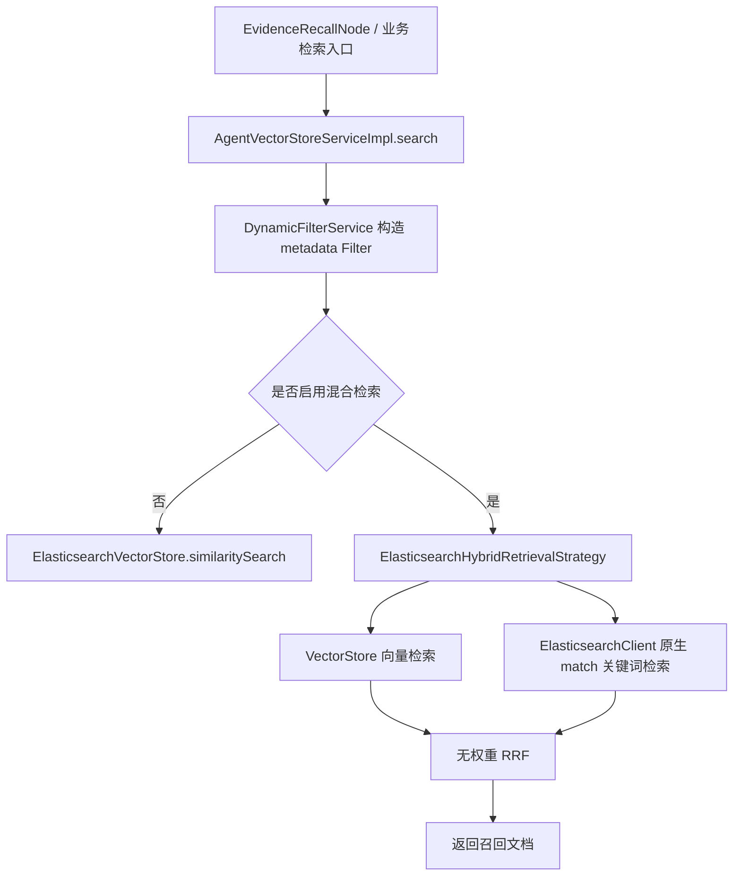
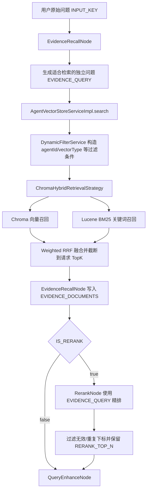
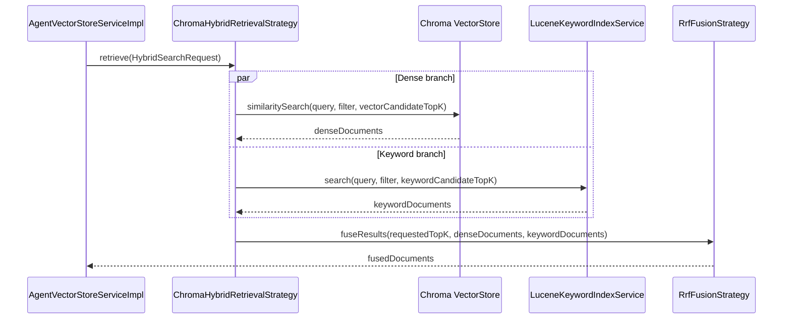
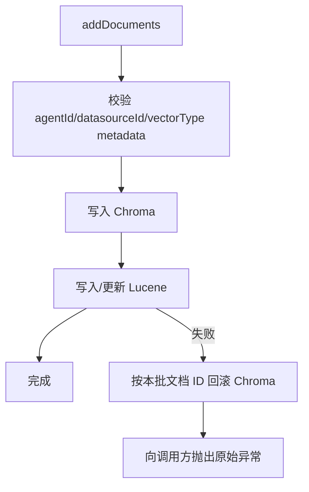
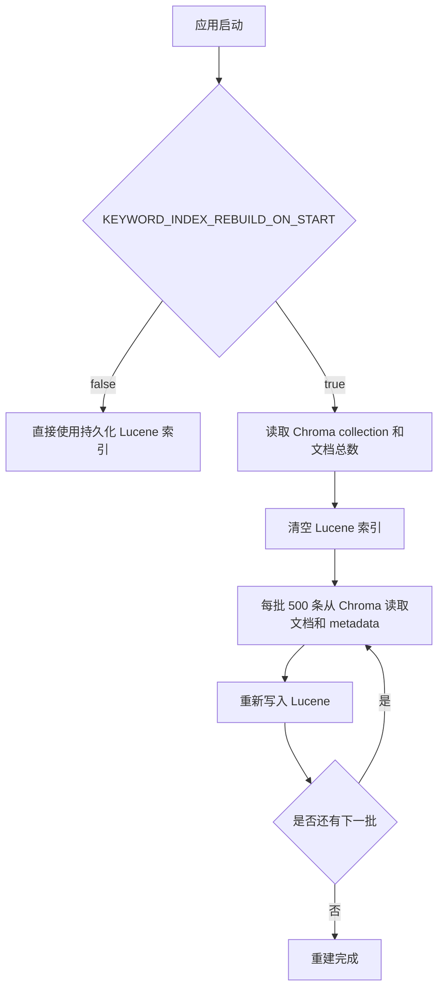

# Chroma 与混合检索改造说明

## 1. 文档目的

本文记录 DataAgent 从 Elasticsearch 向 Chroma 迁移，以及在本地 Chroma 不直接提供原有混合检索能力的情况下，如何通过 Lucene BM25、RRF 和 `RerankNode` 构建新的混合检索链路。

文档重点回答以下问题：

1. 为什么要进行这次改造；
2. 原来的调用链是什么；
3. 代码和配置具体改了什么；
4. 现在的查询、写入、删除和启动恢复链路是什么；
5. 新方案如何处理一致性、故障降级和敏感配置；
6. 当前方案的限制及后续优化方向。

## 2. 改造目标和最终结果

本次改造的目标是：

- 项目不再依赖 Elasticsearch；
- 默认向量数据库改为 Chroma；
- 保留“语义召回 + 关键词召回”的混合检索能力；
- 使用 RRF 融合两路召回结果；
- 允许 `RerankNode` 使用 LLM 对融合结果做最终重排；
- 数据库密码、API Key 等敏感信息不写入 YAML，也不提交到 Git；
- Chroma 与关键词索引出现短暂不一致时，具备恢复机制；
- 检索的一条分支故障或超时时，仍可使用另一条分支返回结果。

最终采用的架构是：

```text
Chroma       = 语义向量检索、文档主存储
Lucene       = 本地持久化 BM25 关键词索引
Weighted RRF = 融合 Chroma 与 Lucene 的排名
RerankNode   = 使用 LLM 对融合候选做最终精排
```

主运行配置默认使用 Chroma。原有的 Simple/Milvus Profile 暂时保留用于兼容和测试，但 Chroma 混合检索 Bean 只会在 `spring.ai.vectorstore.type=chroma` 时启用。Elasticsearch 的依赖、Profile、策略实现和测试已删除。

## 3. 为什么这样改

### 3.1 为什么不能只把 Elasticsearch 类型改成 Chroma

原方案中 Elasticsearch 同时承担两种职责：

- 通过 Spring AI `VectorStore` 执行向量相似度检索；
- 通过 Elasticsearch 原生 `match` 查询执行关键词检索。

Chroma 可以很好地承担向量检索和元数据过滤，但本地 Chroma 并不等价于 Elasticsearch 的全文检索能力。Chroma Cloud Search API 提供更完整的混合检索能力，但本项目使用的是可本地部署的 Chroma，因此不能简单复用原来的 Elasticsearch 关键词查询代码。

如果只保留 Chroma，则精确术语、编号、英文缩写、表名等内容可能仅依赖向量模型召回，召回稳定性会下降。因此需要为 Chroma 补充一条独立的关键词检索通道。

### 3.2 为什么选择 Lucene

Lucene 是嵌入式 Java 搜索库，不需要再部署一个独立搜索服务，适合当前“只部署 Chroma，不再部署 Elasticsearch”的目标。

本方案使用：

- `BM25Similarity`：对关键词相关性排序；
- `SmartChineseAnalyzer`：处理中英文混合内容；
- `FSDirectory`：将索引持久化到本地目录或 Docker Volume；
- 精确字段：保存 metadata 的可过滤字段；
- Stored Field：保存原始文本和 metadata，用于还原 Spring AI `Document`。

### 3.3 为什么使用 RRF，而不是直接相加分数

Chroma 相似度分数和 Lucene BM25 分数不在同一个尺度上，直接相加会导致某一路结果长期占优。

RRF（Reciprocal Rank Fusion）只依赖每一路的排名，不要求两种分数可比较。本项目进一步加入分支权重：

```text
score(document) = denseWeight / (rrfK + denseRank)
                + keywordWeight / (rrfK + keywordRank)
```

默认配置：

```text
rrfK         = 60
denseWeight  = 0.7
keywordWeight = 0.3
```

这样既保留语义检索的主导作用，又能让包含精确关键词的文档获得额外排名优势。

### 3.4 为什么还需要 RerankNode

RRF 是高效、稳定的粗排算法，但它只知道两路排名，并不真正理解用户问题和文档的完整语义关系。

`RerankNode` 使用 LLM 阅读融合后的有限候选集合，并返回候选下标的新顺序，适合作为最终精排。它不会替代 Chroma、Lucene 或 RRF，而是位于三者之后：

```text
召回负责“尽量找全” → RRF 负责“低成本融合” → Rerank 负责“提高最终相关性”
```

## 4. 改造前的调用链

### 4.1 改造前的查询链路



其主要特点是：

- 向量检索和关键词检索都依赖 Elasticsearch；
- 关键词分支需要将 Spring AI Filter 转换成 Elasticsearch 查询；
- 两路结果使用固定参数 RRF 融合；
- 关键词查询异常时返回空结果，由向量分支兜底；
- 向量分支失败时，整个混合检索仍可能失败；
- `ResultEvaluationNode` 当时只是空实现，没有真正完成重排。

### 4.2 改造前的写入和删除链路


只有一个存储目标，不需要维护第二份关键词索引。

## 5. 改造后的调用链

### 5.1 完整的证据召回和精排链路



如果 `EVIDENCE_QUERY` 为空，`RerankNode` 会回退使用原始 `INPUT_KEY`。

### 5.2 混合检索内部链路



两条分支并行执行：

- Chroma 分支使用 Embedding 和相似度阈值；
- Lucene 分支使用 BM25 和同一份 metadata Filter；
- 两路候选数可以大于最终 TopK，为融合和重排保留空间；
- 任一路超时或抛出异常时，记录警告并用空列表代替；
- 只要另一条分支正常，检索仍可完成；
- 两条分支都失败时返回空列表，不制造错误结果。

### 5.3 新的文档写入链路



Chroma 是主存储，Lucene 是可重建的派生索引。写入时先写 Chroma，再写 Lucene。Lucene 写入失败时，会尝试删除刚写入 Chroma 的文档，降低双写不一致概率。

### 5.4 新的删除链路

按 ID 删除时：

```text
vectorStore.delete(ids)
    → keywordIndexService.deleteByIds(ids)
```

按 metadata 删除时：

```text
构造 Spring AI Filter.Expression
    → Chroma 按过滤条件删除
    → Lucene 将同一 Filter 转换成 Lucene Query 后删除
```

Lucene 当前支持以下 Filter 操作：

- `AND`、`OR`、`NOT`；
- `EQ`、`NE`；
- `IN`、`NIN`；
- `ISNULL`、`ISNOTNULL`。

范围过滤操作目前未实现。如果未来业务检索需要 `GT/GTE/LT/LTE`，应同时扩展 Lucene 字段建模和 Filter 转换器，不能只修改 Chroma 查询。

### 5.5 应用启动时的恢复链路



这一机制有两个作用：

1. 从旧版本升级时，为 Chroma 中已有数据建立关键词索引；
2. 修复上次运行期间因进程崩溃或删除操作部分失败造成的数据漂移。

对于数据量较大的生产环境，可以在首次确认重建成功后设置：

```properties
KEYWORD_INDEX_REBUILD_ON_START=false
```

此时依赖正常的双写流程持续维护 Lucene，并通过运维任务定期执行校验或重建。

## 6. 具体代码变更

### 6.1 依赖调整

根 `pom.xml` 和 `data-agent-management/pom.xml`：

- 删除 Elasticsearch Spring AI Starter 和 Elasticsearch Client 版本管理；
- 加入 `spring-ai-starter-vector-store-chroma`；
- 加入 `lucene-core`；
- 加入 `lucene-analysis-smartcn`；
- 加入 `lucene-queryparser`；
- 统一管理 Lucene 版本。

### 6.2 删除的 Elasticsearch 文件

- `application-elasticsearch.yml`；
- `ElasticsearchHybridRetrievalStrategy.java`；
- `ElasticsearchHybridRetrievalStrategyTest.java`；
- `MetadataDocumentRetriever` 中的 Elasticsearch 特殊分支；
- `DataAgentProperties` 中的 `elasticsearchMinScore`；
- 文档、Docker 和测试中的 Elasticsearch 配置与说明。

### 6.3 新增的关键词索引组件

| 文件 | 作用 |
| --- | --- |
| `KeywordIndexService.java` | 定义关键词索引的写入、删除、查询、计数和清空接口 |
| `LuceneKeywordIndexService.java` | Lucene BM25 持久化实现，包含中文分词和 metadata Filter 转换 |
| `ChromaKeywordIndexInitializer.java` | 应用启动时从 Chroma 分页重建 Lucene |

### 6.4 新增的混合检索实现

| 文件 | 作用 |
| --- | --- |
| `ChromaHybridRetrievalStrategy.java` | 组合 Chroma 向量检索和 Lucene 关键词检索 |
| `HybridRetrievalConfiguration.java` | 仅在 Chroma + hybrid enabled 时创建 Lucene、RRF、混合策略和重建器 Bean |
| `AbstractHybridRetrievalStrategy.java` | 支持两路独立候选数、并行检索、超时和故障降级 |
| `HybridSearchRequest.java` | 支持为向量分支指定 candidate TopK |
| `RrfFusionStrategy.java` | 支持配置 `rrfK`、向量权重和关键词权重 |

### 6.5 双写和一致性修改

`AgentVectorStoreServiceImpl` 新增可选的 `KeywordIndexService`：

- `addDocuments`：Chroma + Lucene 双写；
- `deleteDocumentsByMetadata`：Chroma + Lucene 双删；
- 批量 ID 删除：Chroma + Lucene 双删；
- `replaceDocumentsByMetadata`：新文档双写、旧文档双删，并在失败时尝试回滚；
- 保留 `Optional<KeywordIndexService>`，以兼容没有启用混合检索的测试或其他 Profile。

### 6.6 Rerank 修改

| 文件 | 作用 |
| --- | --- |
| `EvidenceRecallNode.java` | 输出候选文档和独立检索问题 `EVIDENCE_QUERY` |
| `RerankNode.java` | 调用 LLM 生成排序下标，重排候选并限制最终数量 |
| `RerankDispatcher.java` | 根据 `IS_RERANK` 决定是否进入精排节点 |
| `DataAgentConfiguration.java` | 注册状态键、节点和工作流边 |
| `Constant.java` | 新增 `EVIDENCE_QUERY`、`RERANK_NODE` 等状态常量 |

`RerankNode` 对 LLM 返回做了防御性处理：

- 忽略 `null` 下标；
- 忽略越界下标；
- 忽略重复下标；
- 将 LLM 未覆盖的文档按原顺序补到末尾；
- 最后按 `rerankTopN` 截断；
- 解析失败时保持原始顺序。

## 7. 配置变更

### 7.1 默认 Chroma 配置

`application.yml` 中默认配置为：

```yaml
spring:
  ai:
    vectorstore:
      type: chroma
      chroma:
        client:
          host: ${CHROMA_HOST:http://localhost}
          port: ${CHROMA_PORT:8000}
          key-token: ${CHROMA_KEY_TOKEN:}
          username: ${CHROMA_USERNAME:}
          password: ${CHROMA_PASSWORD:}
        tenant-name: ${CHROMA_TENANT:SpringAiTenant}
        database-name: ${CHROMA_DATABASE:SpringAiDatabase}
        collection-name: ${CHROMA_COLLECTION:data_agent}
        initialize-schema: ${CHROMA_INITIALIZE_SCHEMA:true}
```

### 7.2 混合检索配置

| 环境变量 | 默认值 | 含义 |
| --- | ---: | --- |
| `HYBRID_SEARCH_ENABLED` | `true` | 是否启用 Chroma + Lucene 混合检索 |
| `HYBRID_SEARCH_TIMEOUT_MS` | `3000` | 每路检索的超时时间，单位毫秒 |
| `HYBRID_VECTOR_CANDIDATE_TOP_K` | `30` | Chroma 参与融合的候选数量 |
| `HYBRID_KEYWORD_CANDIDATE_TOP_K` | `30` | Lucene 参与融合的候选数量 |
| `HYBRID_RRF_K` | `60` | RRF 平滑参数 |
| `HYBRID_DENSE_WEIGHT` | `0.7` | Chroma 向量分支权重 |
| `HYBRID_KEYWORD_WEIGHT` | `0.3` | Lucene 关键词分支权重 |
| `RERANK_TOP_N` | `8` | LLM 精排后保留的文档数量 |
| `KEYWORD_INDEX_PATH` | `./vectorstore/lucene` | Lucene 索引目录 |
| `KEYWORD_INDEX_REBUILD_ON_START` | `true` | 启动时是否从 Chroma 重建 Lucene |

### 7.3 为什么不把密码写进 YAML

数据库密码、Chroma Token、模型 API Key 等信息改为通过环境变量注入，原因包括：

- 防止秘密被提交到 Git 历史；
- 防止秘密被构建进 Docker 镜像；
- 开发、测试和生产可以使用同一份 YAML；
- 可以在不修改代码的情况下轮换密码；
- CI/CD、Kubernetes 和云平台可以直接使用各自的 Secret 管理能力。

仓库提供 `.env.example` 作为字段模板，真正的 `.env` 已被 `.gitignore` 排除。

本地使用方式：

```powershell
Copy-Item .env.example .env
```

然后只在本机 `.env` 中填写真实信息。生产环境应优先使用部署平台的 Secrets，不应上传 `.env`。

## 8. Docker 变更

`docker-file/docker-compose.yml` 新增或调整：

- Chroma 作为默认向量数据库服务；
- Chroma 数据挂载到 `chroma-data` Volume；
- 后端通过服务名 `http://chroma` 访问 Chroma；
- Lucene 索引挂载到 `lucene-index` Volume；
- 后端通过 `env_file: ../.env` 注入环境变量；
- 数据库密码不再直接写入 Compose 文件。

容器内 Lucene 路径固定为：

```text
/app/vectorstore/lucene
```

## 9. 一致性和故障处理

### 9.1 数据角色

```text
Chroma = 权威数据源
Lucene = 可从 Chroma 重建的派生索引
```

这个定义很重要。两个系统之间没有分布式事务，因此不能承诺任意进程崩溃点上的强一致性，但可以通过回滚和重建实现可恢复的最终一致性。

### 9.2 已实现的保护

- Lucene 写入失败时，尝试回滚本批 Chroma 文档；
- 替换失败时，尝试删除已经写入的新文档；
- 应用启动时可从 Chroma 全量重建 Lucene；
- 向量检索失败时可退化为关键词检索；
- 关键词检索失败时可退化为向量检索；
- 每条检索分支均受超时控制；
- Lucene 索引使用持久化目录，不因正常重启丢失。

### 9.3 仍然存在的窗口

按 metadata 删除时采用“先 Chroma、后 Lucene”。如果 Chroma 删除成功、Lucene 删除失败，Lucene 会暂时残留文档。默认启动重建可以清理这些残留。

如未来需要更强一致性，可以继续增加：

- Outbox/事件表；
- 带重试的索引同步任务；
- Chroma/Lucene 文档 ID 定期校验；
- 管理端手动重建关键词索引接口；
- 双写失败指标和告警。

## 10. 测试和验证

本次新增或修改了以下重点测试：

- `ChromaVectorStoreBasicFlowIntegrationTest`：真实 Chroma 写入、相似度查询和删除；
- `ChromaLuceneHybridRetrievalIntegrationTest`：真实 Chroma + Lucene + RRF 混合检索；
- `LuceneKeywordIndexServiceTest`：中文 BM25、metadata Filter、upsert 和删除；
- `RrfFusionStrategyTest`：RRF 排名、去重、TopK 和分支权重；
- `AbstractHybridRetrievalStrategyTest`：并行融合、空结果和向量失败降级；
- `AgentVectorStoreServiceImplTest`：双写和双删；
- `RerankNodeTest`：无效下标、重复下标、补齐和 TopN；
- `VectorStoreConfigurationTest`：Chroma 与混合检索默认配置绑定。

验证结果：

- Chroma 基础真实集成测试通过；
- Chroma + Lucene 真实混合检索测试通过；
- 本次改造相关测试通过；
- Checkstyle 0 违规；
- Maven 依赖树中无 Elasticsearch 依赖；
- 仓库业务代码和配置中无 Elasticsearch 残留引用。

完整 management 模块执行了 1644 项测试：1639 项通过、3 项跳过、2 项原有非向量库测试失败。两个失败分别是业务知识更新次数断言和 `QueryEnhanceDispatcher` 异常断言，不属于本次 Chroma/混合检索改造范围。

真实 Chroma 测试默认不自动执行，需要显式启用：

```powershell
mvn -pl data-agent-management `
  '-Dtest=ChromaVectorStoreBasicFlowIntegrationTest,ChromaLuceneHybridRetrievalIntegrationTest' `
  '-Ddataagent.chroma.integration=true' test
```

## 11. 参数调优建议

### 11.1 精确编号、表名和术语较多

可以适当提高：

```properties
HYBRID_KEYWORD_WEIGHT=0.4
HYBRID_DENSE_WEIGHT=0.6
```

### 11.2 自然语言问答为主

保持默认的 `0.7/0.3`，或进一步提高向量分支权重。

### 11.3 召回不足

优先增加两个 candidate TopK，而不是直接增加最终 TopK：

```properties
HYBRID_VECTOR_CANDIDATE_TOP_K=50
HYBRID_KEYWORD_CANDIDATE_TOP_K=50
```

候选增加会提高 Chroma、Lucene和 Rerank 的开销，需要结合延迟监控调节。

### 11.4 启动过慢

确认 Lucene 已完整构建且正常双写后，可关闭每次启动重建：

```properties
KEYWORD_INDEX_REBUILD_ON_START=false
```

## 12. 当前限制

- 本地混合检索是应用侧实现，不是 Chroma 服务端原子查询；
- Lucene 是单实例本地索引，多后端副本部署时每个副本需要独立维护索引，或共享只允许单写的持久化设计；
- metadata 范围过滤暂未映射到 Lucene；
- 双写属于可恢复的最终一致性，不是分布式强一致性；
- LLM Rerank 会增加调用成本和延迟，应限制候选数和 `RERANK_TOP_N`；
- `GraphServiceImpl` 当前将 `IS_RERANK` 默认设为 `true`，后续可改成 Agent 级或请求级配置；
- 大规模数据场景不建议每次启动全量重建，应改成增量同步加定期校验。

## 13. 官方参考资料

- [Spring AI Chroma Vector Database](https://docs.spring.io/spring-ai/reference/api/vectordbs/chroma.html)
- [Chroma Full Text Search](https://docs.trychroma.com/docs/querying-collections/full-text-search)
- [Chroma Cloud Hybrid Search](https://docs.trychroma.com/cloud/search-api/hybrid-search)
- [Chroma Search API Overview](https://docs.trychroma.com/cloud/search-api/overview)
- [Lucene BM25Similarity](https://lucene.apache.org/core/9_12_1/core/org/apache/lucene/search/similarities/BM25Similarity.html)
- [Lucene SmartChineseAnalyzer](https://lucene.apache.org/core/8_2_0/analyzers-smartcn/org/apache/lucene/analysis/cn/smart/SmartChineseAnalyzer.html)

