中文 | [English](./QUICK_START-en.md)

# 快速开始

本文档将指导您完成 DataAgent 的安装、配置和首次运行。

## 📋 环境要求

- **JDK**: 17 或更高版本
- **MySQL**: 5.7 或更高版本
- **Node.js**: 22 或更高版本
- **pnpm**: 11 或更高版本
- **Docker**: 本地启动默认 Chroma 向量库时需要；执行 Python 步骤时也需要
- **向量数据库**: 默认使用 Chroma（本地端口 `8000`）

## 🗄️ 1. 业务数据库准备

可以在项目仓库获取测试表和数据：

文件在：`data-agent-management/src/main/resources/sql`，里面有4个文件：
- `schema.sql` - 功能相关的表结构
- `data.sql` - 功能相关的数据
- `product_schema.sql` - 模拟数据表结构
- `product_data.sql` - 模拟数据

将表和数据导入到你的MySQL数据库中。

```bash
# 示例：使用 MySQL 命令行导入
mysql -u root -p your_database < data-agent-management/src/main/resources/sql/schema.sql
mysql -u root -p your_database < data-agent-management/src/main/resources/sql/data.sql
mysql -u root -p your_database < data-agent-management/src/main/resources/sql/product_schema.sql
mysql -u root -p your_database < data-agent-management/src/main/resources/sql/product_data.sql
```

## ⚙️ 2. 配置

### 2.1 配置management数据库

先在项目根目录生成不会被 Git 提交的本地配置文件，然后填写数据库连接信息：

> 初始化行为说明：默认配置为 `spring.sql.init.mode: never`，不会自动创建表或插入示例数据。
> 首次启动前请先执行上面的 SQL 文件，或在明确需要示例数据时通过环境变量
> `DATA_AGENT_DATASOURCE_SQL_INIT=always` 开启初始化。

```bash
cp .env.example .env
```

```dotenv
DATA_AGENT_DATASOURCE_URL=jdbc:mysql://127.0.0.1:3306/saa_data_agent?useUnicode=true&characterEncoding=utf-8&useSSL=false&serverTimezone=Asia/Shanghai
DATA_AGENT_DATASOURCE_USERNAME=请填写
DATA_AGENT_DATASOURCE_PASSWORD=请填写
DATA_AGENT_DATASOURCE_SQL_INIT=never
```

`application.yml` 会自动读取根目录 `.env`；该文件已被 `.gitignore` 忽略。

### 2.2 数据初始化配置

默认关闭自动初始化（`spring.sql.init.mode: never`）。

> 关于如何调整初始化行为，请参考 [开发者指南 - 数据库初始化配置](DEVELOPER_GUIDE.md#8-数据库初始化配置-database-initialization)。

### 2.3 配置模型

> 如果涉及手动管理模型依赖（非默认 Starter），请参考 [开发者指南 - 模型依赖手动管理](DEVELOPER_GUIDE.md#9-模型依赖手动管理-manual-model-dependency)。

启动项目，点击模型配置，新增模型填写自己的apikey即可。

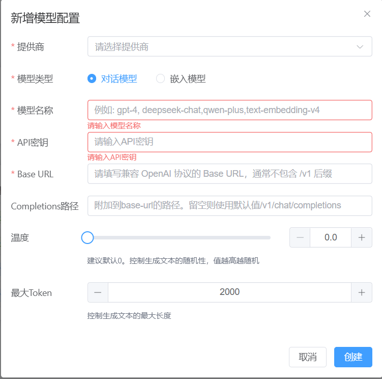

1. 标准提供商接入 如果您使用的是系统内置支持的 AI 提供商（如 OpenAI, Deepseek 等），通常只需要提供模型名称（Model Name）和 API Key。

2. 自定义及本地模型接入 (Ollama/自建网关) 本系统基于 Spring AI 架构，支持标准的 OpenAI 接口协议。如果您接入的是 Ollama 或其他自定义网关，请注意以下几点：

	- 协议兼容：请参考 Spring AI 官方文档中关于 OpenAI 兼容性的说明，确保您的网关响应格式符合标准。

	- 地址配置：针对自部署模型，请准确填写 base-url（基础地址）和 completions-path（请求路径）。系统会将两者拼接为完整的调用地址，例如：http://localhost:11434/v1/chat/completions

3. 故障排查 如发现配置后无法调用，建议优先使用 Postman 对接您的接口地址进行测试，确认网络连通性及参数格式无误。


### 2.4 嵌入模型批处理策略配置

> 详细配置参数请参考 [开发者指南 - 嵌入模型批处理策略](DEVELOPER_GUIDE.md#2-嵌入模型批处理策略-embedding-batch)。

### 2.5 向量库配置

系统默认使用 Chroma 持久化向量库，并通过应用内 Lucene BM25 提供混合检索。先启动本地 Chroma：

```bash
docker compose -f docker-file/docker-compose.yml up -d chroma
```

连接地址、租户、数据库和集合可通过 `CHROMA_HOST`、`CHROMA_PORT`、`CHROMA_TENANT`、
`CHROMA_DATABASE`、`CHROMA_COLLECTION` 覆盖。若仅需临时内存存储，可设置
`SPRING_PROFILES_ACTIVE=simple`。

#### 2.5.1 向量库依赖引入

您可以自行引入你想要的持久化向量库，只需要往ioc容器提供一个org.springframework.ai.vectorstore.VectorStore类型的bean即可。例如直接引入PGvector的starter

```xml
<dependency>
	<groupId>org.springframework.ai</groupId>
	<artifactId>spring-ai-starter-vector-store-pgvector</artifactId>
</dependency>
```

详细对应的向量库参考文档：https://springdoc.cn/spring-ai/api/vectordbs.html

#### 2.5.2 混合检索索引

Chroma 保存文档、metadata 和稠密向量；Lucene 索引保存在 `KEYWORD_INDEX_PATH` 指定的目录。
系统会同步写入两个索引，并默认在启动时从 Chroma 重建 Lucene。Docker Compose 已配置
`lucene-index` 持久化卷。

#### 2.5.3 向量库配置参数

> 详细配置参数请参考 [开发者指南 - 向量库配置](DEVELOPER_GUIDE.md#3-向量库配置-vector-store)。

### 2.6 检索融合策略

> 详细配置参数请参考 [开发者指南 - 向量库配置](DEVELOPER_GUIDE.md#3-向量库配置-vector-store)。

### 2.7 替换vector-store的实现类

> 关于如何替换默认的 Chroma（如使用 Simple、PGVector、Milvus），请参考 [开发者指南 - 向量库依赖扩展](DEVELOPER_GUIDE.md#向量库依赖扩展)。
>
> 项目已内置 `application-simple.yml` 与 `application-milvus.yml`，通过对应 Profile 即可快速切换，详见 [开发者指南 - 开箱即用的配置示例](DEVELOPER_GUIDE.md#开箱即用的配置示例)。

### 2.8 配置 Python 沙盒

DataAgent 使用 Spring AI Alibaba `1.1.2.2` 的 Sandbox 运行生成的 Python 代码。每次
执行都会创建一个任务级容器，动态依赖安装、业务代码执行和容器清理都在该任务内完成。

先确认 Docker 可用：

```bash
docker info
```

默认配置使用本地 Docker socket、公网 PyPI 和 AgentScope 基础镜像。开发环境通常无需
修改；如需指定 Docker 地址、镜像或私有包索引，可设置：

```bash
export DATAAGENT_SANDBOX_DOCKER_HOST=unix:///var/run/docker.sock
export DATAAGENT_SANDBOX_IMAGE=agentscope-registry.ap-southeast-1.cr.aliyuncs.com/agentscope/runtime-sandbox-base:latest
export DATAAGENT_PYPI_INDEX_URL=https://pypi.org/simple
```

生产环境应使用固定镜像 digest 和企业私有 PyPI 代理，并在基础设施层限制沙盒只能访问
包代理。完整配置、依赖协议和故障处理见
[高级功能 - Python 执行环境配置](ADVANCED_FEATURES.md#-python-执行环境配置)。

## 🚀 3. 启动管理端

在项目根目录运行：

```bash
docker compose -f docker-file/docker-compose.yml up -d chroma
./mvnw -pl data-agent-management spring-boot:run
```

或者在IDE中直接运行 `DataAgentApplication.java`。

## 🌐 4. 启动WEB页面

进入 `data-agent-frontend-nuxt` 目录

### 4.1 安装依赖

```bash
pnpm install
```

### 4.2 启动服务

```bash
pnpm dev
```

启动成功后，访问地址 http://localhost:3000

### 4.3 验证 Python 动态依赖

完成智能体、模型和数据源配置后，在数据问答页提交一个明确包含 Python 步骤的请求，例如：

```text
先查询 orders 表的 status 和 total_amount 原始数据，再使用 Python 聚合；
Python 通过 PEP 723 声明并导入 six==1.17.0，最终输出 six 版本和各状态汇总。
```

成功时，时间线会依次出现“Python 生成”“Python 执行”“Python 分析”和最终报告，Python
输出中应包含 `six_version: 1.17.0`。任务结束后不应存在残留容器：

```bash
docker ps --format '{{.Names}}' | grep '^dataagent-sandbox-'
```

命令无输出表示任务沙盒已经清理。若依赖安装失败，工作流会把错误反馈给下一次 Python
生成尝试；达到最大重试次数后进入现有降级或终止分支。

## 🎯 5. 系统体验

### 5.1 数据智能体的创建与配置

访问 http://localhost:3000 ，可以看到当前项目的智能体列表（默认有四个占位智能体，并没有对接数据，可以删除掉然后创建新的智能体）

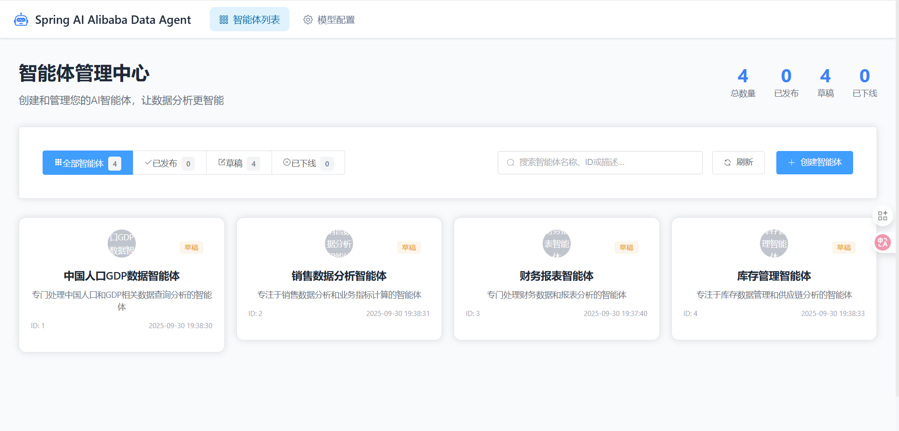

点击右上角"创建智能体" ，这里只需要输入智能体名称，其他配置都选默认。

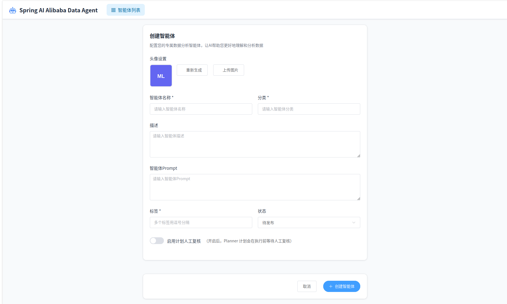

创建成功后，可以看到智能体配置页面。

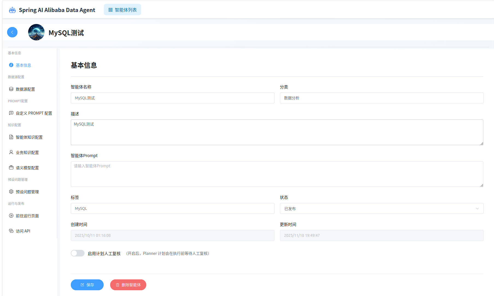

#### 配置数据源

进入数据源配置页面，配置业务数据库（我们在环境初始化时第一步提供的业务数据库）。

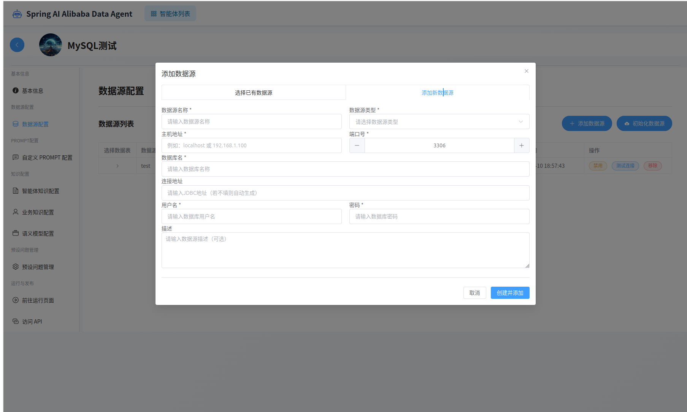

添加完成后，可以在列表页面验证数据源连接是否正常。

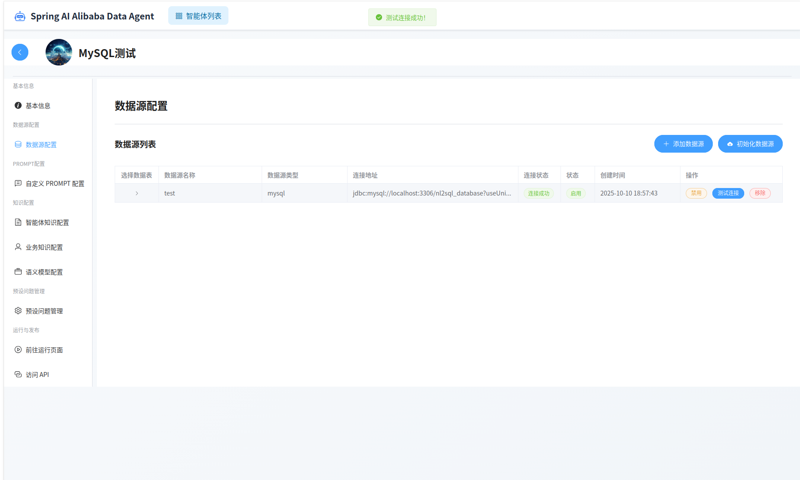

对于添加的新数据源，需要选择使用哪些数据表进行数据分析。

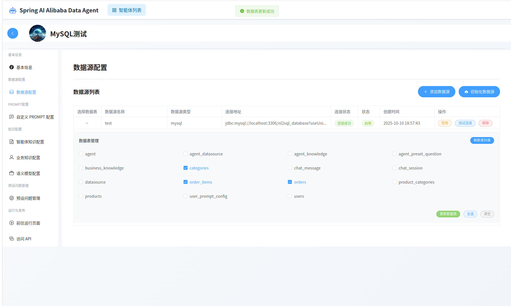

之后点击右上角的"初始化数据源"按钮。

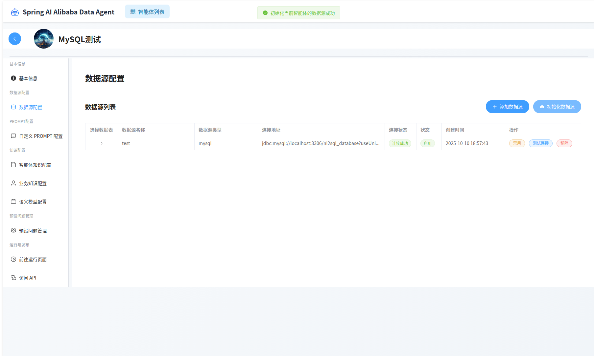

#### 配置预设问题

预设问题管理，可以为智能体设置预设问题

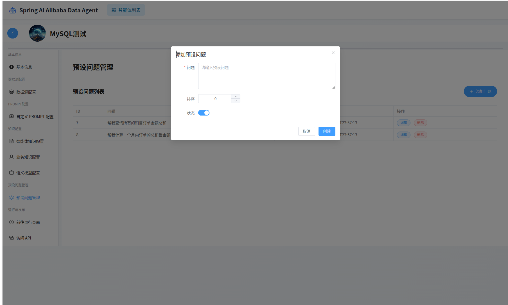

#### 配置语义模型

语义模型管理，可以为智能体设置语义模型。
语义模型库定义业务术语到数据库物理结构的精确转换规则，存储的是字段名的映射关系。
例如`customerSatisfactionScore`对应数据库中的`csat_score`字段。

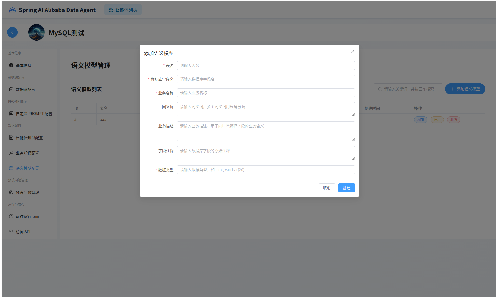

#### 配置业务知识

业务知识管理，可以为智能体设置业务知识。
业务知识定义了业务术语和业务规则，比如GMV= 商品交易总额,包含付款和未付款的订单金额。
业务知识可以设置为召回或者不召回，配置完成后需要点击右上角的"同步到向量库"按钮。

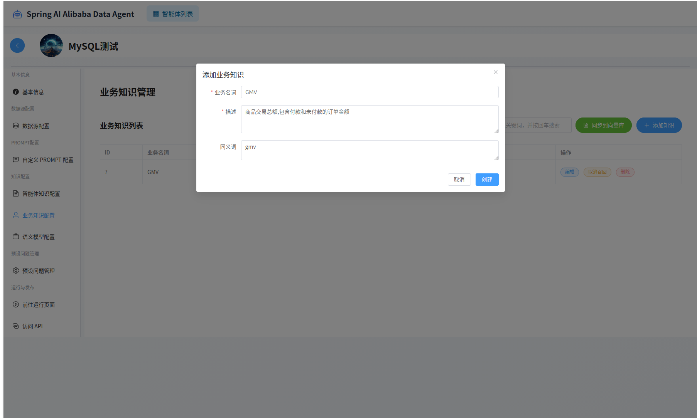

成功后可以点击"前往运行界面"使用智能体进行数据查询。 调试没问题后，可以发布智能体。

> 目前"访问API"在当前版本并没有实现完全，预留着二次开发用的

### 5.2 数据智能体的运行

运行界面

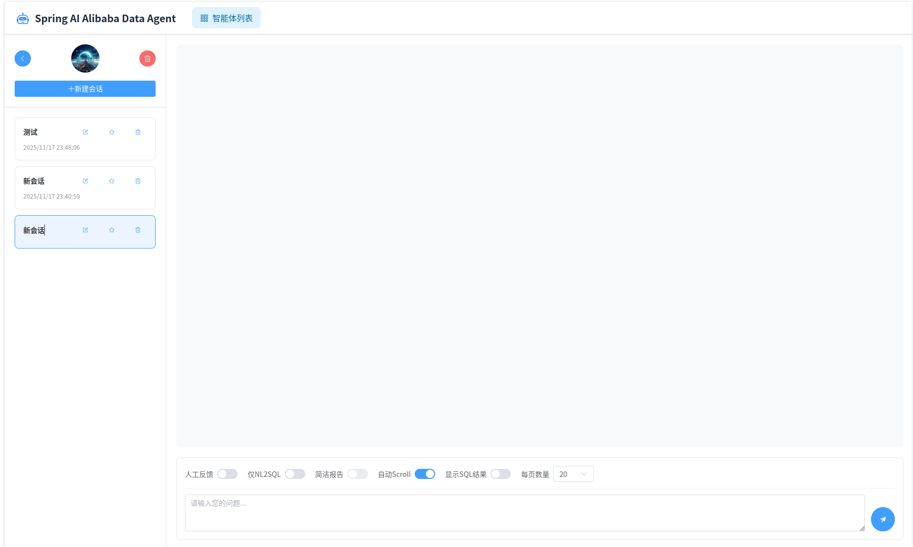

运行界面左侧是历史消息记录，右侧是当前会话记录、输入框以及请求参数配置。

输入框中输入问题，点击"发送"按钮，即可开始查询。

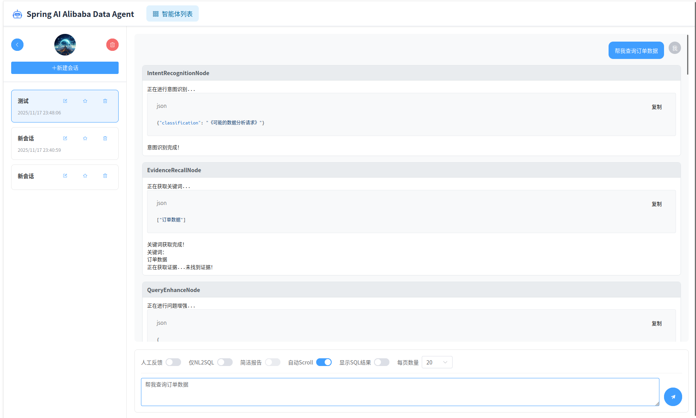

分析报告为HTML格式报告，点击"下载报告"按钮，即可下载最终报告。

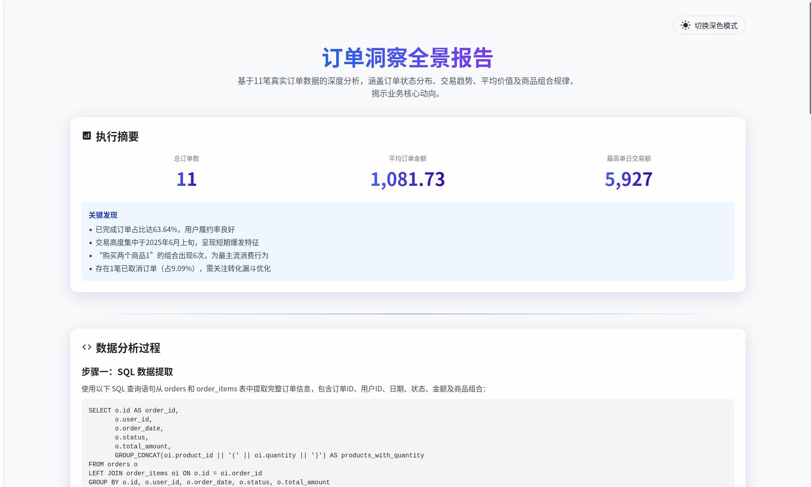

#### 运行模式

除了默认的请求模式，智能体运行时还支持"人工反馈"，"仅NL2SQL"，"简洁报告"和"显示SQL运行结果"等模式。

**默认模式**

默认情况不开启人工反馈模式，智能体直接自动生成计划并执行，并对SQL执行结果进行解析，生成报告。

**人工反馈模式**

如果开启人工反馈模式，则智能体会在生成计划后，等待用户确认，然后根据用户选择的反馈结果，更改计划或者执行计划。

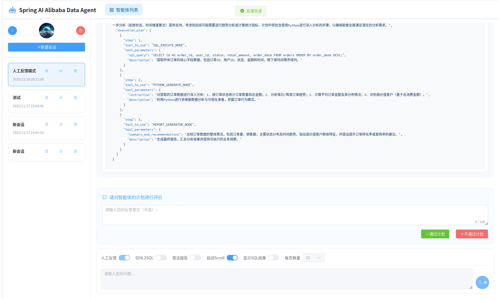

**仅NL2SQL模式**

"仅NL2SQL模式"会让智能体只生成SQL和运行获取结果，不会生成报告。

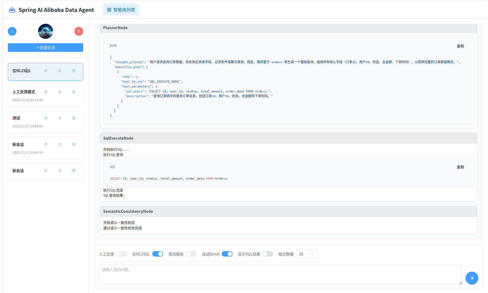

**显示SQL运行结果**

"显示SQL运行结果"会在生成SQL和运行获取结果后，将SQL运行结果展示给用户。

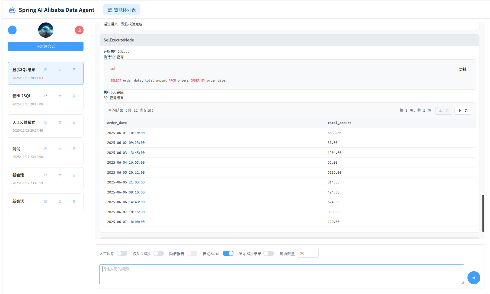


## 📚 下一步

- 了解[架构设计](ARCHITECTURE.md)以深入理解系统原理
- 查看[高级功能](ADVANCED_FEATURES.md)了解更多高级特性
- 阅读[开发者文档](DEVELOPER_GUIDE.md)参与项目贡献
